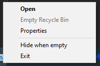

# Compactor

**Compactor** is a Windows application that displays a compact Recycle Bin in the system tray.

It uses the built in Windows Recycle Bin icon for consistency with the rest of the system and updates using system events (such as the deletion of a file or folder) to update the icon, using less resources than other solutions.

## Features

* Adds a Recycle Bin icon to the system tray

  
* Toggle to hide the system tray icon when empty
* Optionally run at startup
* Left click to open the Recycle Bin
* Middle click to empty the Recycle Bin
* Right click to view the context menu

  
  
## Building

Building AlwaysNote requires Visual Studio and NSIS. When the project a built, a NSIS installer is automatically created.
